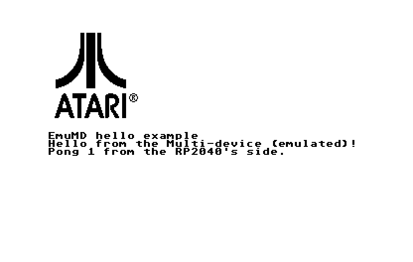

# EmuMD: SidecarTridge Multi-device emulation tools



Run your [SidecarTridge Multi-device](https://sidecartridge.com) firmware in [Hatari](https://www.hatari-emu.org), by [Neil Rackett](https://neilrackett.com/atarist)

## Introduction

Developing for the SidecarTridge Multi-device usually means building a UF2, copying it to the microSD card, rebooting your ST and hoping, every time you change something. EmuMD lets you skip all that and run your firmware in Hatari instead, on your Mac or Linux PC, right alongside the Atari ST software that talks to it.

It builds your firmware's own C code for your computer as a `.mdfw` file, then plugs it into a version of Hatari with a Multi-device on its cartridge port: the ST reads your ROM4 window, your firmware receives its ROM3 commands, and a folder on your computer stands in for the microSD card. Your firmware's cartridge boots just as it would on a real ST, and you can log from it, debug it with your usual tools, and test both sides together without flashing anything.

It comes with a simple tool, `mdfw`, to fit it into your workflow, and a skill for coding agents.

## Getting started

You'll need a C compiler, CMake, Python 3, git and a [TOS image](https://emutos.sourceforge.io/download.html).

1. Clone this repo.
2. Build Hatari with Multi-device support: `make hatari`
3. Build the example firmware: `make`
4. Run it: `cd examples/hello` and `../../tools/mdfw run --tos /path/to/tos.img`

The ST boots with the example's cartridge, prints a greeting the firmware put into ROM4, pings the firmware over ROM3 and prints its answer, as in the screenshot above.

## Adding it to your firmware

Add EmuMD to your firmware's repo as a submodule, create the two files it needs, then build and run:

```sh
git submodule add https://github.com/neilrackett/emumd.git emu/emumd
emu/emumd/tools/mdfw init     # creates mdfw.ini and emu/mdfw_app.c
emu/emumd/tools/mdfw build    # builds build/<name>.mdfw
emu/emumd/tools/mdfw run      # runs it in Hatari
```

In `mdfw.ini` you list the C files that make up your firmware's logic, leaving out anything that sets up hardware (PIO, DMA, clocks, the SD card driver), and `emu/mdfw_app.c` does what your `main()` does once the hardware is ready. `mdfw run --headless` runs it without a window and can save a screenshot, which is handy for automated tests.

You can also load a `.mdfw` into Hatari yourself, with `--md-firmware myapp.mdfw` or by giving it as the last argument, just like a `.prg`.

The [developer guide](docs/GUIDE.md) has all the details, and the [ROTT Accelerator](https://github.com/neilrackett/atarist-rott/tree/atarist/sidecart) is a full working example.

## Porting with an LLM

The repo includes a skill for AI coding agents ([skills/emumd/SKILL.md](skills/emumd/SKILL.md)) that explains how to port a firmware to EmuMD, fix build errors and test it headlessly. It's plain markdown, so it works with any agent:

- **Claude Code**: run `mdfw skill install` in your firmware's repo and it'll be picked up automatically, or add `--user` to install it for all of your projects.
- **Other agents** (Codex, Cursor, Gemini CLI, ...): reference the file from your repo's AGENTS.md or rules, or paste it into context.

## Known limitations

- EmuMD builds your firmware from source, so it can't run `.uf2` files.
- Anything below the Pico SDK (PIO, DMA, Wi-Fi, USB, pins) isn't emulated, so code that relies on it needs to be left out or given a stand-in.
- The emulated Multi-device is infinitely fast, so timing and performance still need testing on real hardware.
- So far it's only been tested on macOS. Linux should work too, but Windows isn't supported.

## What's next?

A few ideas we've had (no promises we'll do them all):

- Run `.uf2` files directly, by emulating the RP2040 itself?
- Add Multi-device support to Hatari itself, so it doesn't need patching?
- Stand in for more of the Pico SDK?

Think you can help? Got an idea of your own? We'd love to hear from you, so why not let me know on [X](https://x.com/neilrackett) or submit a PR.

## License

The source code of the project is licensed under the GNU General Public License v3.0. The full license is accessible in the [LICENSE](LICENSE) file. The files that are built into Hatari are licensed under the GNU General Public License v2.0 or later, like Hatari itself (see [hatari/COPYING](hatari/COPYING)).
