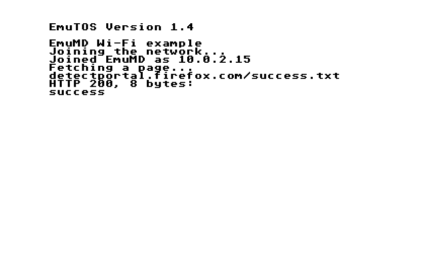

# EmuMD developer guide

How to build SidecarTridge Multi-device firmware as a `.mdfw`, run it in
Hatari and test it, and how it all works. For an overview, see the
[README](../README.md).

## What it is, and is not

A `.mdfw` is your firmware's logic compiled for your computer, not your
`.uf2`. EmuMD replaces the RP2040 underneath it: the Pico SDK calls,
flash, FatFs, the second core, and the PIO and DMA plumbing that serves the
cartridge bus. So:

- **It needs your source**, split so that the logic builds without the
  hardware set-up (see [Preparing a firmware](#preparing-a-firmware)). A
  firmware on the SidecarTridge microfirmware template needs no splitting:
  EmuMD stands in for the template's hardware layer, and its own `main()`
  runs.
- **The Multi-device is infinitely fast.** A command runs to completion
  the moment its last word arrives. Speed, timeouts and races between the
  two cores need real hardware.
- **Anything below the Pico SDK is not emulated**: PIO programs, DMA, USB,
  pins. Firmware that needs them in its logic will need stand-ins. Wi-Fi
  is the exception: a Pico W's goes through your computer's own network
  (see [Wi-Fi](#wi-fi)).

Running unmodified `.uf2` files would take an RP2040 emulator (both cores,
PIO, DMA, SPI, the boot ROM) under Hatari; that is on the roadmap, behind
the same `--md-firmware` option.

## Quick start

You need a C compiler, CMake, Python 3, git, curl, and SDL2 and libpng
for Hatari (the [README](../README.md#getting-started) has the commands
for macOS, Linux and WSL).

```sh
make hatari      # Hatari 2.6.1 + Multi-device support, and EmuTOS 1.4,
                 # in ~/.cache/emumd
make             # the example firmware -> examples/hello/build/hello.mdfw
make test        # the runtime's self-test
make test-wifi   # Wi-Fi's, with the Wi-Fi example (needs libslirp)

cd examples/hello
../../tools/mdfw run
```

The ST boots with the example's cartridge, which prints a greeting the
firmware wrote into ROM4, "pings" the firmware with a ROM3 read and prints
its answer:

```
EmuMD hello example
Hello from the Multi-device (emulated)!
Pong 1 from the RP2040's side.
```

## Using EmuMD in your project

Add EmuMD to your firmware's repository as a submodule, next to the
glue file:

```sh
git submodule add https://github.com/neilrackett/emumd.git emu/emumd
emu/emumd/tools/mdfw init      # mdfw.ini and emu/mdfw_app.c
emu/emumd/tools/mdfw skill install   # optional, for coding agents
```

```
my-firmware/
  mdfw.ini              how to build the .mdfw (committed)
  emu/
    mdfw_app.c          the glue (committed)
    shim/               your stand-in headers, if any (committed)
    emumd/              this repository, pinned (submodule)
  build/                build output (ignore it)
```

The submodule pins the EmuMD your firmware was tested with, so a
clone (or CI, with `git submodule update --init`) builds the same `.mdfw`,
and the agent skill matches it. EmuMD never writes inside its own
folder when building your firmware: objects and the `.mdfw` go to your
`build/`, and the patched Hatari is built once per user in
`~/.cache/emumd` (or `$EMUMD_CACHE`) and shared by every project.
If a project updates its submodule to an EmuMD version whose Hatari patch
changed, `mdfw run` says so; `mdfw hatari` rebuilds it.

Any other checkout works too: put its `tools/` on your `PATH`, or link
`tools/mdfw` somewhere that is; `mdfw` finds the rest from its own location.

A CI job, for example:

```sh
git submodule update --init
emu/emumd/tools/mdfw hatari
emu/emumd/tools/mdfw run --headless --frames 600 --no-user-config \
    --screenshot boot.png --log boot.log
grep -q "my firmware is ready" boot.log
```

## The mdfw tool

| Command | What it does |
| --- | --- |
| `mdfw init [DIR]` | Adds `mdfw.ini` and a glue file, `emu/mdfw_app.c`, to a firmware repository |
| `mdfw build` | Builds the `.mdfw` that `mdfw.ini` describes (incremental, in parallel) |
| `mdfw run [FILE.mdfw]` | Runs it in Hatari (building first when no file is given); anything after `--` goes to Hatari |
| `mdfw run --headless ...` | The same with no window or sound, as fast as possible, for scripts and CI (see below) |
| `mdfw info FILE.mdfw` | Shows a `.mdfw`'s name, version and interface |
| `mdfw cart IMAGE -o cart.h` | Turns a raw cartridge image into a C array of ST words for `mdfw_rom4_load()` |
| `mdfw hatari` | Builds the patched Hatari (same as `make hatari`) |
| `mdfw skill install [--user]` | Gives coding agents the EmuMD skill (see [Coding agents](#coding-agents)) |

`mdfw run` uses `$EMUMD_HATARI`, or `hatari` in `mdfw.ini`'s `[run]`
section, or the Hatari that `mdfw hatari` built. It turns Hatari's GEMDOS
drive off unless you ask for one (`--harddrive DIR`), so your firmware's
cartridge boots; see [Hatari](#hatari) for why. Its TOS is `--tos`, or
`tos` in `[run]`, or else the EmuTOS 1.4 (UK) that `mdfw hatari`
downloaded, whatever your own Hatari settings say.

For scripts, CI and agents, `mdfw run` can run unattended:

| Option | |
| --- | --- |
| `--headless` | No window or sound, fast-forward; stops after 500 frames unless `--frames` says otherwise |
| `--frames N` | Quit after N frames (50 a second on a PAL ST) |
| `--screenshot out.png` | Save the last frame (taken from Hatari's own recording; nothing else to install) |
| `--record out.avi` | Record video and sound: every frame, without the status bar, at 50 Hz (71 with `-- --monitor mono`; `-- --avi-fps 60` for a 60 Hz TOS). A run that ends by itself finishes the file; one stopped by `--timeout` cannot |
| `--log FILE` | Keep Hatari's output, including your firmware's log lines |
| `--timeout SECONDS` | Stop Hatari after this long, whatever happens |
| `--no-user-config` | Ignore your own Hatari settings |
| `-O key=value`, `-V` | `--md-option key=value`, `--md-verbose on` |

If Hatari crashes (the firmware's own crash, often, or the `abort()` of a
failed assertion or `panic()`), `mdfw run` says so and exits non-zero.
To type into the ST from a script, pass Hatari `-- --cmd-fifo FILE` and
write `hatari-event keypress 28` (an ST scancode) to the file.

### mdfw.ini

```ini
[firmware]
name = My App                 ; also MDFW_NAME in your code
version = v1.2.3              ; MDFW_VERSION (template: version.txt)
; output = build/my-app.mdfw  ; default: build/<name>.mdfw
; build_dir = build/mdfw
template = sidecartridge      ; built on the SidecarTridge template: see below
uuid = ...                    ; its app UUID (default: uuid.txt)

[sources]
files =                       ; paths and globs, relative to this file
    emu/mdfw_app.c
    rp/src/*.c                ; .cpp and .cc are built as C++
exclude =                     ; taken out of the files above
    rp/src/main.c
    rp/src/romemul.c

[compile]
shims =                       ; your stand-in headers, searched first
    emu/shim
include =                     ; your include folders, searched after EmuMD's
    rp/src/include
defines =                     ; one per line: NAME or NAME=VALUE
    RELEASE_VERSION=MDFW_VERSION
cflags = -O2                  ; C and C++
cxxflags =                    ; C++ only
ldflags =

[wifi]                        ; the Pico W's Wi-Fi (see Wi-Fi, below)
lwip = pico-sdk/lib/lwip      ; default: lwIP 2.2.1, downloaded once
apps = http/http_client.c     ; lwIP apps, from its src/apps
arch = poll                   ; or background

[run]                         ; defaults for mdfw run
sd = sd                       ; the microSD card folder
tos = /path/to/tos.img        ; default: EmuTOS 1.4 (UK)
machine = megaste
harddrive =                   ; a GEMDOS drive C: for the ST side's files
options =                     ; --md-option key=value, one per line
hatari_args = --memsize 4
```

Headers are found in this order: your `shims`, EmuMD's stand-ins
(`runtime/shim`: the Pico SDK, FatFs, the templates' `debug.h`), `mdfw.h`,
then your `include` folders. So your hardware versions of those headers
are skipped without you having to move them. One exception: a header
that includes a neighbour in quotes (`#include "constants.h"`) finds it
in its own folder before any of these. If your stand-in for such a
header uses the original's include guard, include it ahead of everything
(`cflags = -include my_prefix.h`, with the prefix header in `shims`
including your stand-ins) and the original is then skipped.

Everything is built as the Pico SDK builds for a host: `PICO_BUILD=1`
and `PICO_ON_DEVICE=0` are defined, as is `EMUMD=1` for anything that
has to differ, and enums are the RP2040's sizes (`-fshort-enums`), so
structures kept in flash or shared memory are laid out as on the
device. `_FORTIFY_SOURCE` is off, as on the RP2040: firmware treats its
linker symbols (`extern unsigned int __rom_in_ram_start__`) as the
regions they start, which its checks would stop as overflows.

## Preparing a firmware

### A firmware on the SidecarTridge template

A firmware built on the [SidecarTridge microfirmware
template](https://github.com/sidecartridge/md-microfirmware-template) (a
`uuid.txt`, and `rp/src` with `main.c`, `romemul.c`, `gconfig.c`...) runs
its own `main()` in EmuMD, unchanged, with EmuMD standing in for the
template's hardware layer. `mdfw init` recognises one and writes an
`mdfw.ini` with `template = sidecartridge`, and no glue file:

```ini
[firmware]
name = MD/JS
template = sidecartridge      ; the version and app UUID: version.txt, uuid.txt

[sources]
files =
    rp/src/*.c
    rp/src/settings/settings.c

[compile]
include =
    rp/src
    rp/src/include
    rp/src/settings
```

What EmuMD stands in for:

- **The template's hardware sources**: `romemul.c`, `commemul.c`,
  `select.c`, `hw_config.c` and `sdcard.c` are left out of `[sources]`.
  `sdcard.h`'s calls work on the microSD folder (`sd` in `[run]`).
  ROM3 reads reach the firmware as the PIO and DMA would deliver them,
  through commemul or, in the older template (`init_romemul()` with
  callbacks), the lookup DMA channel's register and its interrupt handler.
  `reset.h` loses its ARM code.
- **The memory map**: `memmap_rp.ld`'s symbols are real ones, at the
  Booster's offsets in EmuMD's flash (`_config_flash_start` is 0x1E0000
  in, and so on), and `__rom_in_ram_start__` is ROM4.
- **The SELECT button**, which is never pressed.
- **The Booster**: on blank flash, EmuMD does what its first run would
  (this app boots, and has the first settings sector), and gives a Wi-Fi
  firmware a network name to join. A jump to the Booster stops the
  firmware, as EmuMD does not run it.
- **The template's defines**: `CURRENT_APP_UUID_KEY`, `RELEASE_VERSION`
  and the rest of what its `CMakeLists.txt` defines (`_DEBUG=1`, so its
  debug code runs; `DPRINTF` goes to the log with `-V`), unless your
  `defines` give them. Your firmware's own defines still go in `defines`.

What you may still have to change in your code: pointers kept in 32-bit
integers (see below), GCC's nested functions, which clang (macOS's `cc`)
rejects (the template's `network.c` has some in `network_scan()`: move
them out as static functions), and ARM assembly behind
`defined(__ARM_ARCH)`, which is true on Apple silicon too
(`defined(__arm__)` is the 32-bit RP2040's). A glue file's `mdfw_app`,
if you write one, replaces EmuMD's.

[MD/JS](https://github.com/neilrackett/md-js) and
[MD/Net](https://github.com/neilrackett/md-net) are built this way, Wi-Fi
and all; each has an `emu/test.sh` that drives it from an ST program.

### Any other firmware

A SidecarTridge firmware's `main()` sets up the hardware (clocks, PIO,
DMA, the SD card), copies its cartridge image into ROM4, then loops. For
EmuMD you keep the loop's work and leave the hardware out:

1. `mdfw init` in your repository.
2. List the sources that hold your firmware's logic in `mdfw.ini`, and
   leave out the ones that only set up hardware: `main.c`, `romemul.c`,
   `commemul.c`, `sdcard.c`, `hw_config.c`, the display code. Keep the
   Wi-Fi code if you want it to work (see [Wi-Fi](#wi-fi)).
3. Fill in `emu/mdfw_app.c`: what `main()` does after the hardware set-up,
   and one pass of the main loop.

```c
#include "mdfw.h"
#include "target_firmware.h"   /* your cartridge image, as ST words */

static int app_init(void) {
  mdfw_rom4_load(target_firmware, target_firmware_length);
  my_protocol_init(mdfw_rom4_base());   /* where the firmware uses ROM_IN_RAM */
  return 0;
}

static bool app_poll(void) {
  return my_main_loop_once();   /* true if there was work: called again */
}

const mdfw_app_t mdfw_app = {
    .name = MDFW_NAME,
    .version = MDFW_VERSION,
    .init = app_init,
    .poll = app_poll,
};
```

4. `mdfw build`. If linking fails with undefined symbols, the firmware
   calls something EmuMD does not stand in for: leave out the source
   that calls it, or define the function in your glue file.

Pointers are 64 bits on your computer. Code that keeps an address in a
32-bit integer (`(uint32_t)&symbol - XIP_BASE`) needs `uintptr_t`
instead, and pointers cannot travel through the 32-bit inter-core FIFO:
pass them some other way, with the FIFO saying when.

### A main loop that never returns

Many firmwares, including every app built on the framebuffer template,
never go back to a main loop: `main()` ends in a loop that blocks,
waiting for the ST's VBL, say. Such a loop cannot run in `poll`, which
has to give the emulator its thread back, so give it to EmuMD as `main`
instead:

```c
static void app_main(void) {
  my_emul_start();   /* never returns */
}

const mdfw_app_t mdfw_app = {
    .name = MDFW_NAME,
    .version = MDFW_VERSION,
    .init = app_init,  /* e.g. load ROM4, so the ST sees the cartridge */
    .main = app_main,
};
```

`main` runs on a thread of its own as core 0, alongside the emulator,
from power-on until power-off, as the RP2040 runs alongside the ST.
There, and on core 1, sleeping waits for emulated time to pass rather
than moving it on, so a firmware thread that waits 20 ms waits while
the ST runs for 20 ms. At power-off the firmware's threads are stopped
at their next wait (a sleep, FIFO, semaphore, `tight_loop_contents()` or
an empty ROM3 ring through `commemul_poll()`), so a loop that spins on a
flag should call `tight_loop_contents()`. `init` and `poll` (if you give
one as well) still run on the emulator's thread.

Firmware built on the SidecarTridge template reads ROM3 through
`commemul.h`; EmuMD provides `commemul_init()` and `commemul_poll()`
(and the `commemul_set_irq_handler()` hook), so that code works unchanged.
Anything else can use `mdfw_rom3_set_irq()` and `mdfw_rom3_pop()`.

The [ROTT Accelerator](https://github.com/neilrackett/atarist-rott/tree/atarist/sidecart)
(on atarist-rott's `atarist` branch) is a full example:
[`sidecart/mdfw.ini`](https://github.com/neilrackett/atarist-rott/blob/atarist/sidecart/mdfw.ini)
and [`sidecart/emu/`](https://github.com/neilrackett/atarist-rott/tree/atarist/sidecart/emu).

## The runtime

`include/mdfw.h` is the whole interface: ROM4 (`mdfw_rom4`,
`mdfw_rom4_load`), ROM3 (`mdfw_rom3_set_irq`, `mdfw_rom3_pop`,
`mdfw_rom3_peek`), the flash
(`mdfw_flash`), the SD card folder, `--md-option` values
(`mdfw_option`, `mdfw_option_int`), logging (`mdfw_log`, `mdfw_debug`) and
emulated time (`mdfw_time_us`).

What stands in for what:

| On the RP2040 | In EmuMD |
| --- | --- |
| ROM4 (ROM_IN_RAM, served by PIO + DMA) | A 64 KB array; word *i* is what the ST reads at $FA0000 + 2*i* |
| ROM3 capture (PIO + DMA ring + IRQ) | A 4096-sample ring; your handler is called on every ROM3 read |
| Flash, XIP | 2 MB array at `XIP_BASE`; `flash_range_erase/program` keep the real alignment and only clear bits. Survives cold resets; `--md-option flash=FILE` keeps it between runs |
| microSD + FatFs | FatFs calls on the `--md-sd` folder, ignoring case like FAT |
| Core 1 | A host thread: `multicore_launch_core1`, the FIFOs both ways, spin locks, critical sections, mutexes, semaphores, SEV/WFE |
| Timer, `sleep_ms` & co. | Emulated time from Hatari. Sleeping on the emulator's thread moves it on; on the firmware's own threads it waits |
| Alarms, repeating timers, alarm pools | Fired on the emulator's thread in emulated time, as the timer interrupt would; one late is fired once, not caught up |
| Hardware divider | C division, with the divider's results for division by zero |
| `DPRINTF` | Hatari's log, with `--md-verbose on` |
| `watchdog_reboot` | The firmware is powered off and on; `watchdog_hw->scratch[]` survives that, and is cleared by a cold reset |
| DMA | Memory-to-memory transfers happen at once (byte swapping and all); ones paced by the PIO or another peripheral do not. `dma_claim_unused_channel(false)` says none is free, so a caller with a CPU path takes it |
| Linker-script regions (`memmap_rp.ld`) | Real symbols at the SidecarTridge Booster's offsets in flash, and `__rom_in_ram_start__` at ROM4 |
| Wi-Fi (CYW43), `cyw43_arch`, `async_context` | With `[wifi]`: any network can be joined, and the chip's frames go to your computer's network (see [Wi-Fi](#wi-fi)) |
| Board ID, `get_rand_32()` & co. | A fixed ID (`--md-option board_id=` for another); your computer's random numbers |
| GPIO | Pins read high (a template firmware's SELECT, low); writes go nowhere |
| IRQ set-up, clocks, voltage, PIO headers | Accepted and ignored |

The firmware's `poll` runs on Hatari's thread whenever the ST reads the
cartridge, every 256th ROM4 read (so a firmware can make progress while
the ST polls it) and once per frame; timers are checked on every read.
Its `main` and core 1, if started, run alongside.

A reboot powers the firmware off and on again in the same process, so
its variables keep their values, where the RP2040 would start with fresh
RAM: `init` should set up whatever it relies on.

## Wi-Fi



A Pico W firmware's Wi-Fi works in EmuMD. Add `[wifi]` to `mdfw.ini` and
the firmware's own network code (`cyw43_arch`, lwIP and whatever it
builds on them) runs as it is, over your computer's own network
connection. Joining succeeds whatever the network's name and password
(they are not checked), then the device gets an address by DHCP, looks
names up by DNS, and can reach whatever your computer can. Nothing needs
setting up, and no special permissions: as QEMU's user networking does,
with the same library (libslirp), EmuMD makes the device's connections
from your computer, as an ordinary program.

```ini
[compile]
include =
    rp/src                    ; where lwipopts.h is
    rp/src/include

[wifi]
lwip = pico-sdk/lib/lwip      ; your Pico SDK's lwIP (default: 2.2.1,
                              ; the SDK's, downloaded once)
apps = http/http_client.c     ; the lwIP apps you use, from its src/apps
arch = poll                   ; or background: as CMakeLists.txt links
                              ; pico_cyw43_arch_lwip_poll or
                              ; pico_cyw43_arch_lwip_threadsafe_background
```

It needs libslirp: `brew install libslirp pkg-config` on macOS, or
`sudo apt install libslirp-dev libglib2.0-dev pkg-config` on Linux.

Keep your own network code in `[sources]`, and leave lwIP and the CYW43
driver out: EmuMD builds lwIP with your `lwipopts.h`, and stands in for
the chip, `cyw43_arch` and `async_context` itself.

The device's network looks like this:

| Address | |
| --- | --- |
| 10.0.2.15 | The device (from DHCP) |
| 10.0.2.2 | The router, and also your computer: a server on your computer's `localhost:8000` is `http://10.0.2.2:8000/` to the device |
| 10.0.2.3 | DNS, which asks your computer's |

`--md-option`s (`-O` with `mdfw run`):

| Option | |
| --- | --- |
| `wifi=badauth` | Joining fails as it would with the wrong password (`CYW43_LINK_BADAUTH`). Also `nonet` (no such network), `fail`, and `off` (no networks at all, so scans find none) |
| `wifi_join_ms=N` | How long joining takes, in emulated time (250) |
| `wifi_rssi=N` | Signal strength, in dBm (-45) |
| `wifi_forward=tcp:8080:80` | Lets your computer connect to the device: `localhost:8080` reaches its port 80. Separate several with commas; `udp:` for UDP |
| `wifi_pcap=FILE` | Saves every frame, both ways, for Wireshark |
| `board_id=E6614103E74D4401` | The board ID; its last 3 bytes end the MAC address, 28:CD:C1:4D:44:01 by default |

Things to know:

- **Credentials.** A firmware on the SidecarTridge template keeps the
  network's name and password in its settings in flash, and does not try
  to join without a name. Any will do: with `template = sidecartridge`,
  EmuMD sets "EmuMD" if there is none. Otherwise set one in your glue
  file's `init`: `settings_put_string(gconfig_getContext(),
  PARAM_WIFI_SSID, "EmuMD");` (or keep a flash file with the settings,
  `-O flash=FILE`).
- **Waiting for the network.** On the firmware's own threads (`main`, core
  1), waiting for work (`cyw43_arch_wait_for_work_until()`,
  `async_context_wait_for_work_ms()`) waits for the network as well as
  for emulated time. On the emulator's thread (`init`, `poll`), it moves
  emulated time on instead, as sleeping does there. That is fine for
  joining and DHCP, which never leave EmuMD, but anything that has to
  wait for your computer's network (DNS, a TCP connection) has to be
  polled across calls, or waited for on the firmware's own thread.
- **Fast-forward.** Replies come in real time, but the firmware's timeouts
  run in emulated time, which `--headless` runs far ahead. So while frames
  are moving, EmuMD holds Hatari back to real time; when the network is
  quiet, Hatari runs as fast as it can.
- **A power cycle** (a cold reset, or `watchdog_reboot()`) switches the
  chip off and on: connections are dropped and DHCP starts again. lwIP is
  set up only once, as the Pico SDK does, so the rest of its state
  carries over, as the firmware's own variables do.
- **The radio itself is not emulated:** signal, interference, speed and the
  chip's timing need a real Pico W. Access point mode starts, but nothing
  can join it. lwIP has to run without an OS (`NO_SYS=1`, as with both
  `pico_cyw43_arch_lwip_*` libraries).
- **clang and `network.c`.** The SidecarTridge template's `network_scan()`
  uses GCC's nested functions, which clang (macOS's `cc`) cannot build.
  They use only globals, so they can move out of the function unchanged,
  as static functions.
- **A bigger page than TCP's window.** lwIP's HTTP client leaves calling
  `altcp_recved()` to a `recv_fn` you give it: without that, a body
  bigger than `TCP_WND` stalls until the client times out, on the Pico W
  as here.

`examples/wifi` is a small firmware that joins, then fetches a web page
whenever the ST asks and puts it in ROM4 for the ST to print, and serves a
page of its own on port 80 (`make run`, `make run URL=http://...`, or
`-O wifi_forward=tcp:8080:80` and open `http://localhost:8080`).
`make test-wifi` runs it without Hatari, against a web server of its own.

## Hatari

`hatari/` holds a patch for Hatari 2.6.1 and the files it adds;
`hatari/build-hatari.sh` (or `make hatari`, or `mdfw hatari`) clones Hatari
into `~/.cache/emumd/hatari`, applies it and builds. It also downloads
the 256k EmuTOS 1.4 images, in every language, into
`~/.cache/emumd/emutos-256k-1.4`. New options,
also kept in a `[MultiDevice]` section of `hatari.cfg`:

| Option | |
| --- | --- |
| `--md-firmware <file>` | Run Multi-device firmware `<file>` on the cartridge port (`none` to remove it) |
| `--md-sd <dir>` | The folder standing in for the microSD card |
| `--md-option <key=value>` | Passed to the firmware; repeatable; `none` clears them |
| `--md-verbose <bool>` | Show the firmware's debug output |

A `.mdfw` given as Hatari's last argument is loaded as the firmware.

The patch also adds `leftdown`, `leftup` and `mousemove <dx> <dy>` to the
events Hatari's `--cmd-fifo` takes (`hatari-event <event>`), so scripts
and coding agents can use the ST's mouse as well as its keyboard.
`mousemove` is relative and in ST pixels: move far up and left first to
pin the pointer to the corner, and later moves land at known positions.
And `--run-vbls` (`mdfw run --frames`) quits as closing the window does,
so a recording it ends is a finished file.

On a GEMDOS drive (`--harddrive`), each program's current folder is its
own, as it is in TOS: when a program ends, any change it made to it is
undone. Hatari alone keeps one per drive, so after STinG (which changes
to its own folder, from the AUTO folder) EmuTOS looked there for its
accessories.

EmuMD's Hatari is built without the macOS app bundle, so it has no menu
bar: use its shortcuts instead. Cmd+A starts and stops recording video
(an AVI with sound), Cmd+Y records sound only, and Cmd+O or F12 (fn+F12 on
most Mac keyboards) opens the options. On Linux, right Alt (AltGr) takes
the place of Cmd.

Hatari's own GEMDOS drive emulation needs its own cartridge program at
$FA0000. When a GEMDOS drive (or an extended VDI mode) is on, Hatari keeps
the first 1 KB of the cartridge and your firmware gets the rest, so its
boot code does not run; ST programs that talk to the firmware work as
normal. With no GEMDOS drive, the firmware gets the whole cartridge and
boots as it would on a real ST. Most Multi-device apps boot from the
cartridge and need no drive; `mdfw run` leaves the drive off for that
reason.

A cold reset powers the Multi-device off and on (it is powered from the
cartridge port); a warm reset leaves it running.

## Coding agents

`skills/emumd/SKILL.md` is an [Agent Skill](https://agentskills.io):
how to port a firmware to EmuMD, fix build errors, and run and check
it headlessly. `mdfw skill install` links it into your project's
`.claude/skills/` (relative to the submodule, so every clone has it, at
the matching version); `--user` puts it in `~/.claude/skills/` for all your
projects, and `--copy` copies instead of linking. Claude Code picks it up
from there; other agents that read skills can be pointed at the same folder.

## Licence

GPL-3.0-or-later ([LICENSE](../LICENSE)), except the files that go into Hatari
(`hatari/`, and `include/emumd_plugin.h`, which both sides share), which
are GPL-2.0-or-later like Hatari ([hatari/COPYING](../hatari/COPYING)).
